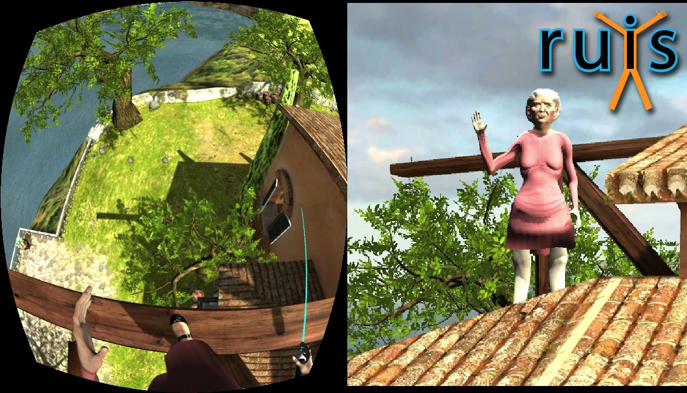

# RUIS
RUIS for Unity is an old school VR Toolkit that had its last official release (1.21) in 2018. The version uploaded here contains a number of further, undocumented improvements.

This toolkit has been mainly used for my research and prototyping of full-body avatars, as well as teaching a VR course. As such, the toolkit is missing a lot of polish. But maybe you can find use of some parts of it.

The RUIS toolkit in this repository is distributed as a project for Unity Editor 2017.4.34f1. We have checked that the project can be updated to work at least with Unity 2019, but some scripts will break and require addressing in order to fix compile errors. I see no reason why RUIS wouldn't work with later Unity versions too, but no doubt various scripts need to be modified.

See 1.21 readme file for details: https://github.com/ttakala/RUIS/blob/trunk/RUIS%20for%20Unity%201.21%20readme.pdf

Please note that this readme does not contain information on the updates that were made after 2018, which changed the avatar functionality in particular.

